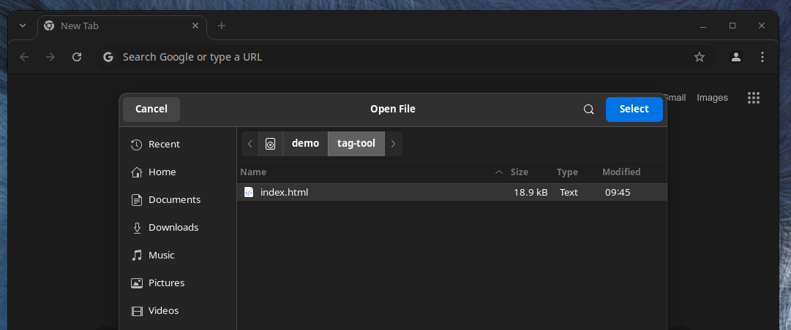

# Extremely basic Dataset Tagging Tool

## Description

This is a basic tool to edit image datasets. \
I aim to provide a single file, dependency free, chrome exclusive, html+js tool for editing local dataset image descriptions.

I am too lazy to edit text files. \
I am too lazy to install complex dataset management tools.

If you are like me this tool is for you.

All you need is Chrome or a Chromium based browser. \
The tool is a HTML page with embedded Javascript.

## How to use

### Open tool

Open the HTML file: `index.html`.

The tool will open without any dataset.

### Open a dataset

Click "Select Directory" and navigate to your dataset folder.

Chrome will prompt for authorization to access your file system. Accept "Edit files".

When you select the directory, images and text files are loaded.

### Tag / Description

The tool scans the dataset directory for images and text files.

When an image does not have an associated text file, the description text area will load empty.
A text file will be created when you update the description.

Changes are triggered when the text area loses focus.
In simple terms, type a change then click outside the text box.

> Changes are immediate and irreversible. The tool does not keep a change history.
> The tool does not provide any undo capabilities.
> Check how your browser handles `Ctrl+Z` if you need to undo a text change.

### Add image

In your file manager, add the images to the dataset directory.

In the tool, click the "Refresh Dataset" button.

### Remove images

You can remove images manually in your file manager, then hit the "Refresh Dataset" button.

You can remove images in the tool by clicking the red "X" button under the image name. \
Removed images and text files are not deleted. They are moved to a `deleted` subdirectory.

### Options

Click the Cogwheel button to open the options panel.

- Zoom
  You can control the "zoom" (width of images & text areas) with the zoom option.
  

## License

MIT